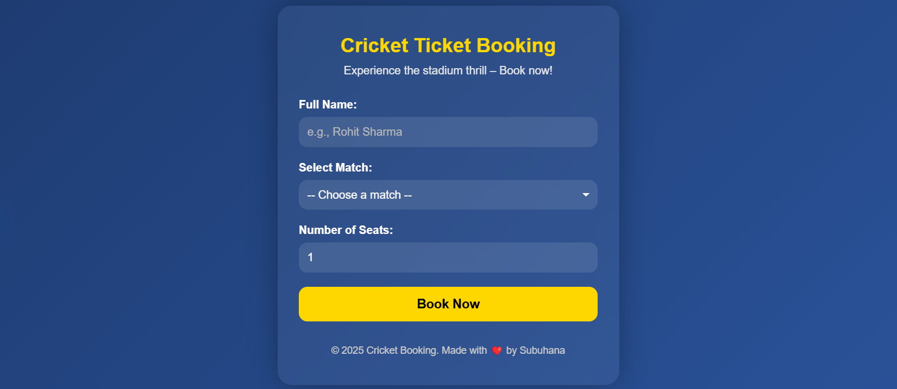
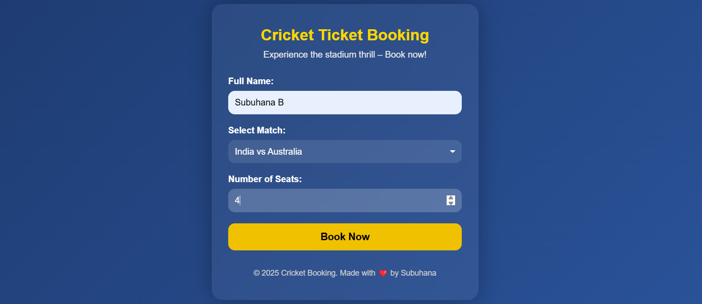

# 🏏 Cricket Ticket Management System

This is a front-end demo of a Cricket Ticket Booking System built using HTML, CSS, and JavaScript.

## 🚀 Features
- Responsive and stylish UI
- Match selection
- Seat booking (1 to 10)
- Dynamic confirmation message

> This is a basic **frontend-only** system (no backend or real payment integration).

## 📁 Files
- `index.html` – Main webpage
- `style.css` – Styles for the page
- `script.js` – JavaScript logic
- `README.md` – Project information

## 📷 Preview

### Output 1

## Output 2

---

## 📌 License
MIT License – free to use and modify.
